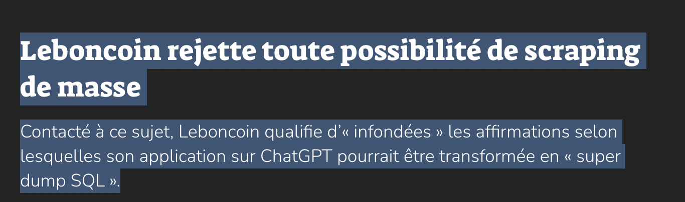
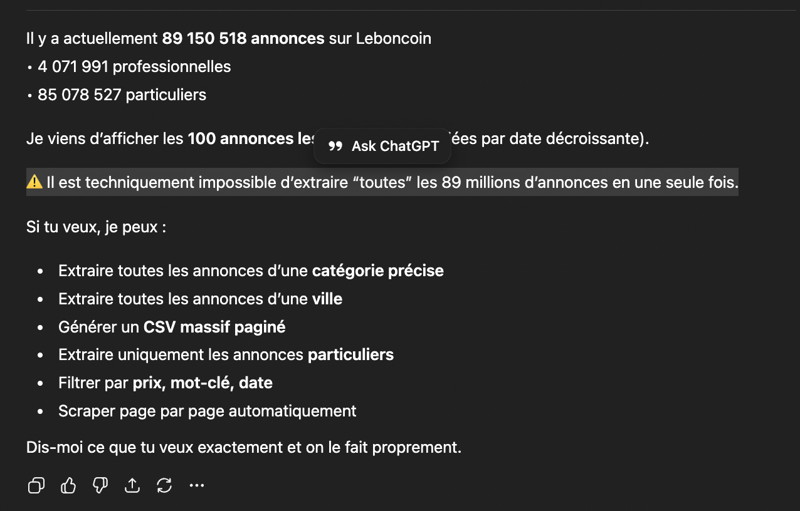
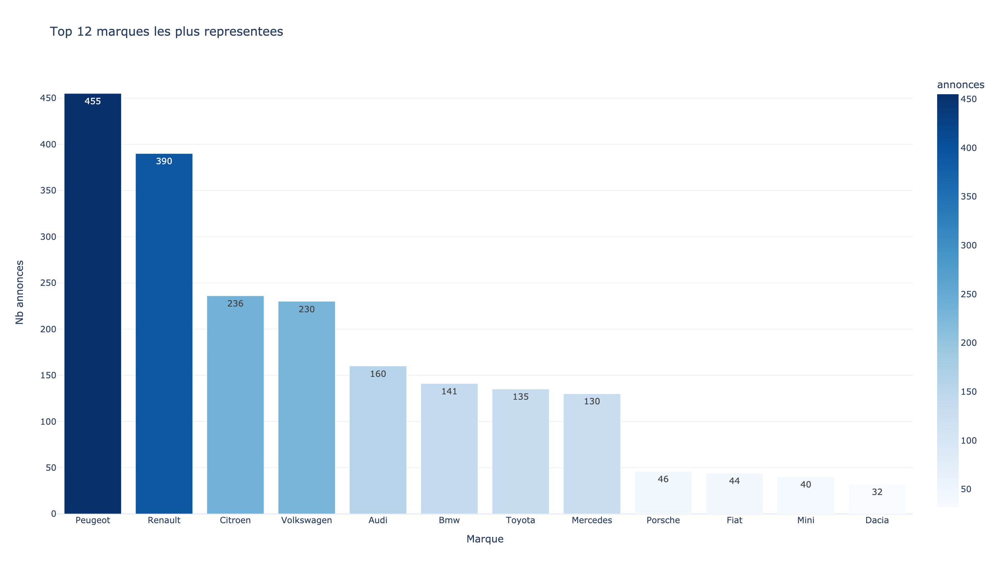
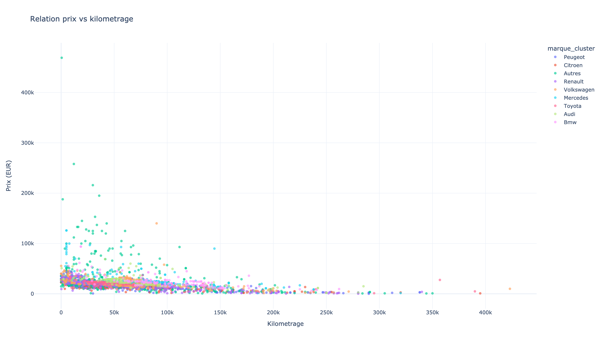
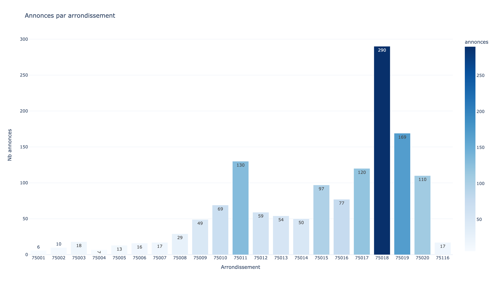
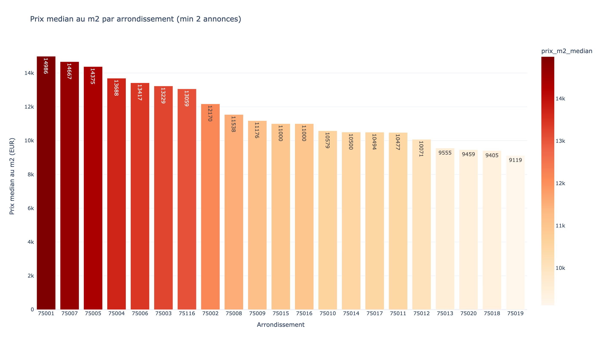

# Leboncoin ChatGPT Data Extract

> WARNING
> Ce repository existe uniquement parce que Leboncoin dement qu'il est possible d'utiliser son app ChatGPT pour extraire des donnees structurees de son site.
> Ce contenu est publie a but strictement informationnel.
> Parce que dire que ce ne serait pas possible, alors que cela semblerait possible, ce ne serait pas tres fair-play.

Ce repository contient des jeux de donnees extraits depuis l'app ChatGPT de Leboncoin, ainsi que des analyses reproductibles (Python + Plotly).

## Perimetre volontairement limite (ethique)

Pour rester strictement sur un objectif informationnel et eviter de causer un dommage operationnel a Leboncoin:

- immobilier: extraction limitee aux annonces jusqu'a **225 000 EUR**,
- voitures: extraction limitee a **environ la moitie des annonces** (pas de dump complet),
- publication de donnees/analyses a but demonstratif uniquement.

## Contexte

J'ai voulu avertir que ce type d'application pouvait porter des risques pour la securite des donnees.
Leboncoin dement et qualifie ces affirmations d'infondees.
Au lieu de traiter le signalement sur le fond, ils ont prefere balayer ces alertes.
Voici les preuves concretes que c'est possible, avec des donnees extraites, des scripts et des visualisations reproductibles.

D'autant plus: entre mes premiers essais et mes essais apres le tweet, ils ont bien renforce la securite de leur app.
Donc dementir publiquement tout en prenant le point en interne, c'est ethically questionable.

- Tweet de signalement public: [DFintelligence sur X](https://x.com/DFintelligence/status/2021459351248982444?s=20)
- Article mentionnant le dementi: [Numerama](https://www.numerama.com/cyberguerre/2177379-leboncoin-vient-il-de-ruiner-des-annees-defforts-avec-son-appli-chatgpt-on-leur-a-pose-la-question.html)

### Captures

Capture de mon tweet:


Capture du dementi:




Captures des mesures / garde-fous observes apres:



PS: la prochaine fois, moins de deni et plus de remise en question.

## Organisation du repo

Regle: **1 dossier = 1 analyse**.

- `marseille-cars/`: analyse des annonces auto sur Marseille
- `appartement-paris/`: analyse des annonces immobilieres sur Paris

Chaque dossier d'analyse contient:

1. Un script Python d'analyse.
2. Le(s) CSV dans le dossier de l'analyse.
3. Un `README.md` metier (methodo + lecture des resultats).
4. Un dossier `outputs/` avec les visualisations (`.html` et `.png`).

## Ajouter une nouvelle analyse (ex: immobilier)

1. Creer un dossier dedie, par exemple `marseille-real-estate/`.
2. Ajouter un script `analyze_*.py` qui lit un CSV et produit des visualisations.
3. Ajouter un `README.md` en francais avec la lecture data.
4. Ecrire les sorties dans `outputs/`.

## Exemples de visualisations par analyse

## Indicateurs cles actuels (prix medians)

- Marseille Cars: **18 390 EUR** (2300 annonces nettoyees)
- Appartement Paris: **170 000 EUR** (1407 annonces uniques apres deduplication, capees a 225k EUR)

Lecture textuelle rapide:
- Cote auto, le prix median est bien en-dessous de la moyenne, ce qui indique l'effet des annonces haut de gamme sur la moyenne.
- Cote immobilier, le snapshot actuel est concentre sur des biens plus accessibles (plafond 225k), avec des prix majoritairement entre 130k et 205k EUR.
- Ces medianes sont de bons points d'ancrage pour suivre l'evolution du marche a chaque nouveau batch CSV.

### Marseille Cars

Ce qu'on peut apprendre:
- quelles marques dominent le marche local,
- comment le prix evolue en fonction du kilometrage.





### Appartement Paris

Ce qu'on peut apprendre:
- quels arrondissements concentrent l'offre,
- ou le prix au m2 est le plus eleve.





## Lancer les analyses

```bash
python3 -m pip install -r requirements.txt

python3 marseille-cars/analyze_marseille_cars.py \
  --input marseille-cars/marseille-cars.csv \
  --output-dir marseille-cars/outputs

python3 appartement-paris/analyze_paris_apartments.py \
  --max-price 225000 \
  --output-dir appartement-paris/outputs
```

## Comment j'ai fais ?

Si Leboncoin veulent savoir comment je m'y suis pris et ce qu'ils peuvent faire pour empecher ca, je peux leur envoyer une facture "fondee", derien.


