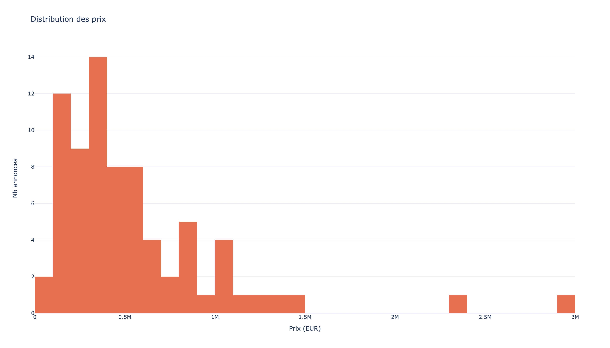
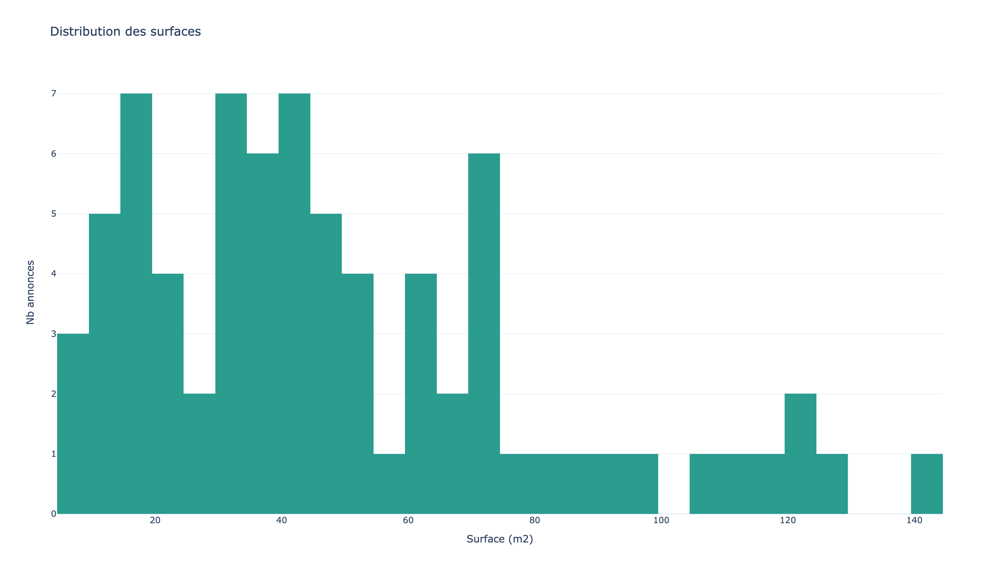
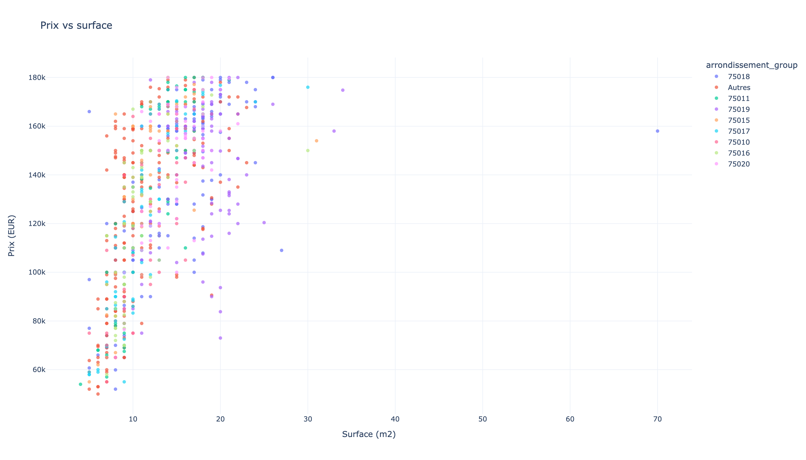
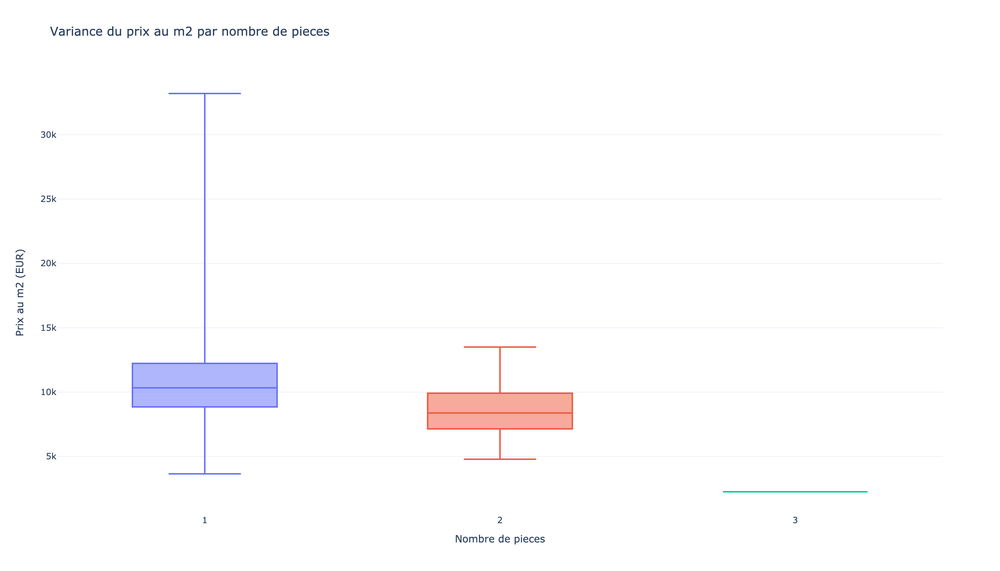
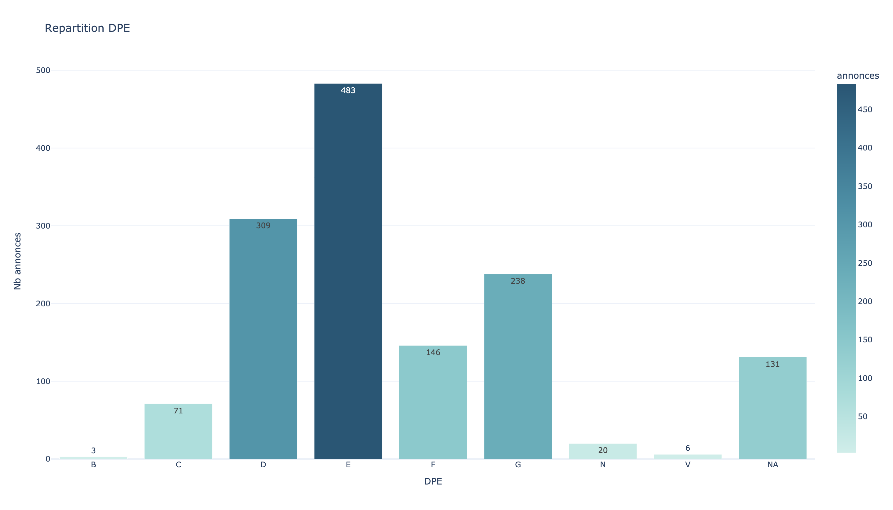
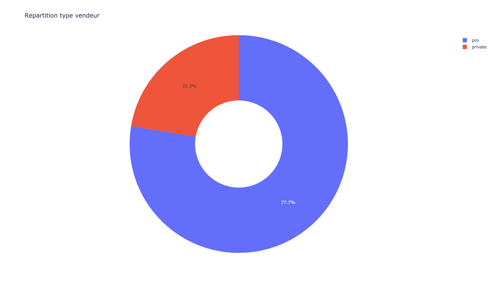

# Notebook Analyse: Appartement Paris

Dossier data: `appartement-paris/`  
Ce dossier est pret pour accumuler plusieurs extractions CSV dans le temps.

## 0) Setup

```bash
python3 -m pip install -r requirements.txt
```

## 1) Execution

Depuis la racine du repo:

```bash
python3 appartement-paris/analyze_paris_apartments.py \
  --output-dir appartement-paris/outputs
```

Le script charge automatiquement tous les CSV de `appartement-paris/*.csv`,
les concatene et deduplique par `id` (on garde la version la plus recente de l'annonce).

## 2) Snapshot actuel

Sur les fichiers presents actuellement:

- Lignes brutes concatenees: `304`
- Annonces uniques apres deduplication: `75`
- Arrondissements couverts: `17`
- Prix median: `459 000 EUR`
- Surface mediane: `43 m2`
- Prix median au m2: `10 150 EUR/m2`

Lecture rapide:

- Marche majoritairement professionnel (`pro` tres dominant).
- Forte dispersion de prix selon la surface et l'arrondissement.
- Le prix au m2 varie sensiblement entre arrondissements.

## 3) Annonces par arrondissement


[Version interactive](outputs/01_annonces_par_arrondissement.html)

## 4) Prix median au m2 par arrondissement


[Version interactive](outputs/02_prix_m2_par_arrondissement.html)

## 5) Distribution des prix



[Version interactive](outputs/03_distribution_prix.html)

## 6) Distribution des surfaces



[Version interactive](outputs/04_distribution_surface.html)

## 7) Prix vs surface



[Version interactive](outputs/05_prix_vs_surface.html)

## 8) Variance du prix au m2 par pieces



[Version interactive](outputs/06_variance_prix_m2_par_pieces.html)

## 9) Repartition DPE



[Version interactive](outputs/07_repartition_dpe.html)

## 10) Repartition type vendeur



[Version interactive](outputs/08_repartition_type_vendeur.html)

## 11) Remarques data quality

- Le dossier peut contenir des snapshots repetes des memes annonces.
- La deduplication par `id` est appliquee pour une lecture de stock annonce propre.
- Les analyses evolueront automatiquement quand tu ajoutes de nouveaux CSV dans ce dossier.
