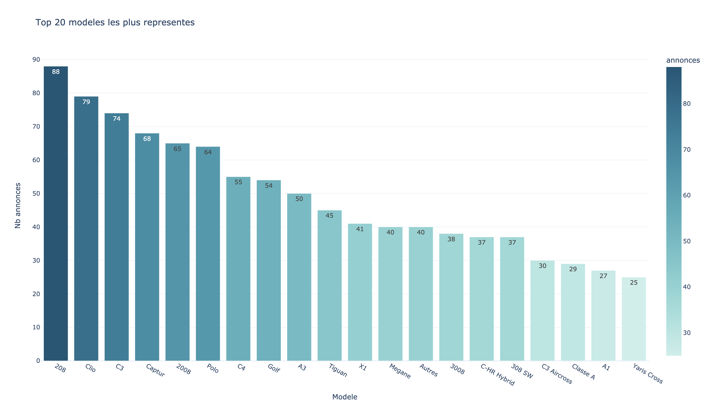
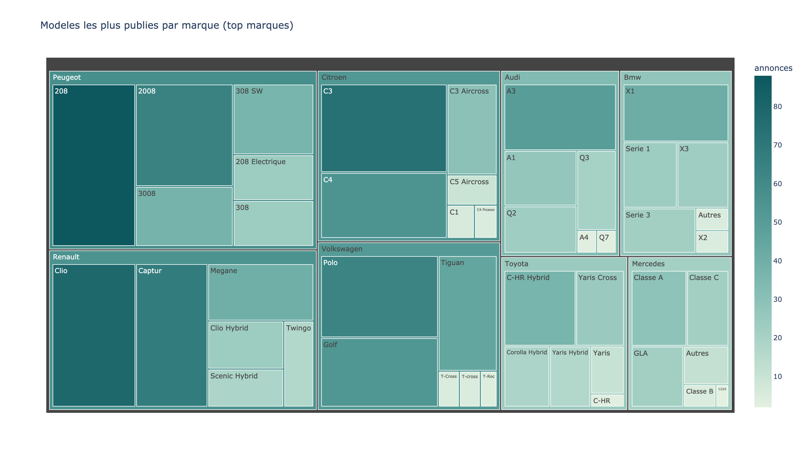
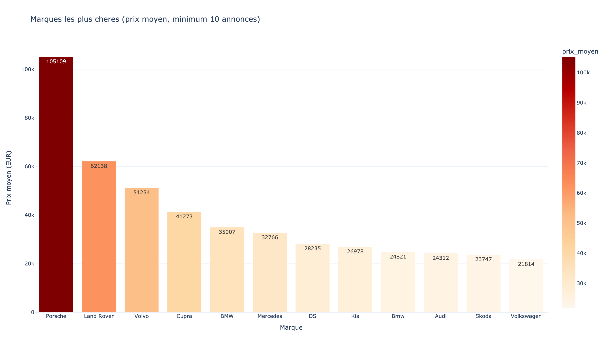
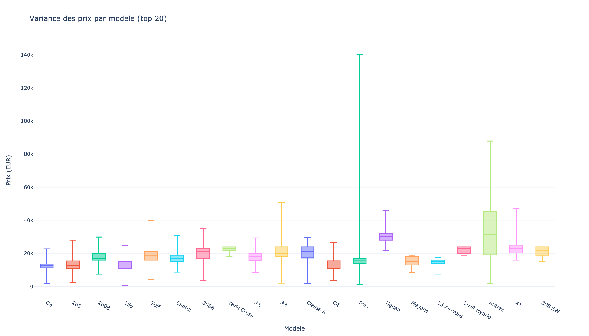
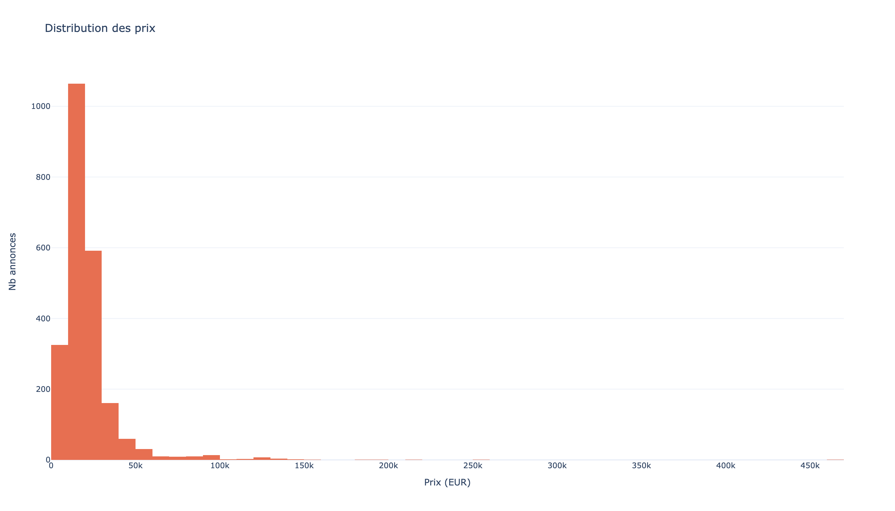

# Notebook Analyse: Marseille Cars

Dataset: `marseille-cars/marseille-cars.csv`

Ce README est structure comme un mini notebook d'analyse.

## Perimetre volontairement limite

Pour rester dans une logique strictement informationnelle:

- je n'ai conserve qu'environ **la moitie des annonces voitures, uniquement sur Marseille**,
- je n'ai pas cherche a produire un dump complet,
- l'objectif est de documenter un point technique, pas d'impacter l'activite de la plateforme.

## 0) Setup

```bash
python3 -m pip install -r requirements.txt
```

## 1) Chargement des donnees

```python
import pandas as pd

df = pd.read_csv("marseille-cars/marseille-cars.csv")
for col in ["annee", "km", "prix_eur"]:
    df[col] = pd.to_numeric(df[col], errors="coerce")

df = df.dropna(subset=["marque", "modele", "annee", "km", "prix_eur"])
df = df[(df["prix_eur"] > 0) & (df["km"] >= 0)]
```

## 2) Apercu du dataset

- Lignes: `2300`
- Marques: `40`
- Modeles: `617`
- Prix moyen: `21 879 EUR`
- Prix median: `18 390 EUR`
- Quartiles prix (Q1 / Q3): `13 397.5 EUR` / `24 415 EUR`
- Km moyen: `70 283`
- Km median: `57 056`
- Annee mediane: `2021`
- Correlation prix/km: `-0.345`

Lecture rapide:
- Marche fortement concentre sur des marques generalistes.
- Presence d'un segment premium visible dans le haut de distribution.
- Relation negative nette entre prix et kilometrage.

Lecture textuelle complementaire:
- Le **prix median a 18 390 EUR** est plus robuste que la moyenne (`21 879 EUR`) car la moyenne est tiree vers le haut par les annonces premium/luxe.
- 50% des annonces se situent entre **13.4k EUR** et **24.4k EUR**, ce qui donne une zone de marche "coeur" assez lisible.
- Le kilometrage median a **57 056 km** et l'annee mediane **2021** indiquent un stock majoritairement recent.
- En volume, Peugeot, Renault, Citroen et Volkswagen dominent, ce qui structure fortement la dynamique de prix locale.

## 3) Marques les plus representees


[Version interactive](outputs/01_marques_plus_representees.html)

Notes:
- Peugeot, Renault, Citroen et Volkswagen dominent en volume.
- Le marche local est tire par des vehicules de grande diffusion.

## 4) Modeles les plus representees



[Version interactive](outputs/02_modeles_plus_representes.html)

Notes:
- Top modele: 208, puis Clio et C3.
- Forte presence de citadines et SUV compacts.

## 5) Modeles par marque (treemap)



[Version interactive](outputs/03_modeles_par_marque_treemap.html)

Notes:
- La profondeur de gamme varie selon les marques.
- Certaines marques sont concentrees sur peu de modeles forts.

## 6) Marques les plus cheres (prix moyen)



[Version interactive](outputs/04_marques_plus_cheres.html)

Notes:
- Porsche, Land Rover, Volvo, Cupra et Mercedes ressortent en tete.
- Le classement est calcule avec un seuil minimal d'annonces pour limiter le bruit.

## 7) Variance des prix par modele



[Version interactive](outputs/05_variance_prix_par_modele.html)

Notes:
- Variance elevee sur les modeles tres representes.
- Meme modele != meme niveau de prix (annee, finition, etat, km).

## 8) Distribution du kilometrage


[Version interactive](outputs/06_distribution_km.html)

Notes:
- Concentration importante entre ~20k et ~100k km.
- Longue trainee sur les hauts kilometrages.

## 9) Prix vs kilometrage


[Version interactive](outputs/07_prix_vs_km.html)

Notes:
- Tendance globale decroissante: plus le km augmente, plus le prix baisse.
- Dispersion restante due a la marque, au modele et a l'annee.

## 10) Distribution des prix



[Version interactive](outputs/08_distribution_prix.html)

Notes:
- Masse principale de l'offre dans les segments de prix intermediaires.
- Queue haute visible sur les vehicules premium/luxe.

## 11) Reproduire l'analyse

```bash
python3 marseille-cars/analyze_marseille_cars.py \
  --input marseille-cars/marseille-cars.csv \
  --output-dir marseille-cars/outputs
```

## 12) Limites data

- Casse de marque parfois incoherente (`Bmw` vs `BMW`).
- Quelques outliers de prix peuvent tirer la moyenne.
- Snapshot temporel: les conclusions evoluent avec les nouvelles extractions.
